# Task 4: Infrastructure as Code (IaC) with Terraform

This repository contains the submission for DevOps Internship Task 4.

**Objective:** Provision a local Docker container using Terraform.

## Tools Used

* **Terraform**
* **Docker**

## File Structure

This repository is organized using Terraform best practices:

* `main.tf`: Contains the primary resource definitions (the Docker image and container).
* `variables.tf`: Declares input variables (like `image_name`) to make the configuration reusable.
* `outputs.tf`: Defines outputs to display useful information after provisioning (like the Container ID).
* `.gitignore`: Prevents Terraform state files (`.tfstate`) and local directories (`.terraform`) from being committed.

## System Architecture

This diagram shows the flow of control, from the user's command to the final running container.

```mermaid
graph LR
    %% Direction: Left to Right
    A([👩‍💻 Developer<br>(User)]) -->|runs| B([🧭 Terraform CLI])
    B -->|1️⃣ Reads| C[(📄 main.tf<br>📄 variables.tf)]
    B -->|2️⃣ Uses| D([🐳 Docker Provider])
    D -->|3️⃣ Sends instructions to| E([⚙️ Docker Daemon])
    E -->|4️⃣ Pulls| F[(📦 nginx:latest image)]
    E -->|5️⃣ Creates| G([🧱 nginx_container])
    E -->|6️⃣ Exposes port| H([🌐 8080 on Host])

    %% Styling
    style A fill:#dbeafe,stroke:#1e3a8a,stroke-width:2px,color:#111
    style B fill:#d1fae5,stroke:#065f46,stroke-width:2px,color:#111
    style C fill:#fef3c7,stroke:#92400e,stroke-width:2px,color:#111
    style D fill:#e0f2fe,stroke:#0369a1,stroke-width:2px,color:#111
    style E fill:#f3e8ff,stroke:#6b21a8,stroke-width:2px,color:#111
    style F fill:#fee2e2,stroke:#991b1b,stroke-width:2px,color:#111
    style G fill:#fde68a,stroke:#92400e,stroke-width:2px,color:#111
    style H fill:#e0f7fa,stroke:#006064,stroke-width:2px,color:#111
```

## Execution Steps & Logs

Here is the complete lifecycle of the Terraform configuration, from initialization to destruction.

### 1. `terraform init`

Initializes the working directory, downloading the Docker provider.

#### Output:
```shell
Initializing the backend...
Initializing provider plugins...
- Finding kreuzwerker/docker versions matching "~> 3.0.1"...
- Installing kreuzwerker/docker v3.0.2...
- Installed kreuzwerker/docker v3.0.2 (self-signed, key ID BD080C4571C6104C)
Partner and community providers are signed by their developers.
If you'd like to know more about provider signing, you can read about it here:
https://developer.hashicorp.com/terraform/cli/plugins/signing
Terraform has created a lock file .terraform.lock.hcl to record the provider
selections it made above. Include this file in your version control repository
so that Terraform can guarantee to make the same selections by default when
you run "terraform init" in the future.

Terraform has been successfully initialized!
```
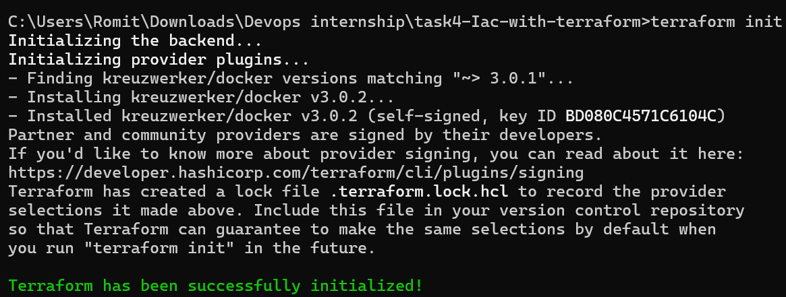

### 2. `terraform plan`

Creates an execution plan to preview the changes. This step shows that one image will be pulled and one container will be created.

#### Output:
```shell
Terraform used the selected providers to generate the following execution plan. Resource actions are indicated with the following
symbols:
  + create

Terraform will perform the following actions:

  # docker_container.nginx_container will be created
  + resource "docker_container" "nginx_container" {
      + attach                                      = false
      + bridge                                      = (known after apply)
      + command                                     = (known after apply)
      + container_logs                              = (known after apply)
      + container_read_refresh_timeout_milliseconds = 15000
      + entrypoint                                  = (known after apply)
      + env                                         = (known after apply)
      + exit_code                                   = (known after apply)
      + hostname                                    = (known after apply)
      + id                                          = (known after apply)
      + image                                       = (known after apply)
      + init                                        = (known after apply)
      + ipc_mode                                    = (known after apply)
      + log_driver                                  = (known after apply)
      + logs                                        = false
      + must_run                                    = true
      + name                                        = "terraform-nginx-demo"
      + network_data                                = (known after apply)
      + read_only                                   = false
      + remove_volumes                              = true
      + restart                                     = "no"
      + rm                                          = false
      + runtime                                     = (known after apply)
      + security_opts                               = (known after apply)
      + shm_size                                    = (known after apply)
      + start                                       = true
      + stdin_open                                  = false
      + stop_signal                                 = (known after apply)
      + stop_timeout                                = (known after apply)
      + tty                                         = false
      + wait                                        = false
      + wait_timeout                                = 60

      + healthcheck (known after apply)

      + labels (known after apply)

      + ports {
          + external = 8080
          + internal = 80
          + ip       = "0.0.0.0"
          + protocol = "tcp"
        }
    }

  # docker_image.nginx will be created
  + resource "docker_image" "nginx" {
      + id           = (known after apply)
      + image_id     = (known after apply)
      + keep_locally = false
      + name         = "nginx:latest"
      + repo_digest  = (known after apply)
    }

Plan: 2 to add, 0 to change, 0 to destroy.

Changes to Outputs:
  + container_external_port = 8080
  + container_id            = (known after apply)
  + container_name          = "terraform-nginx-demo"
```
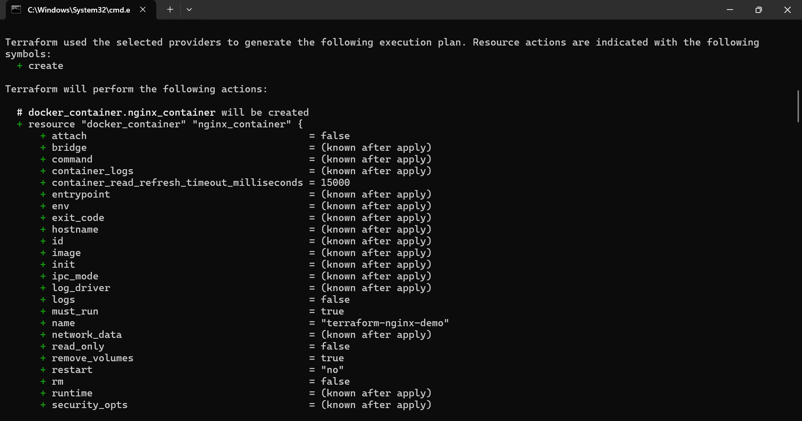
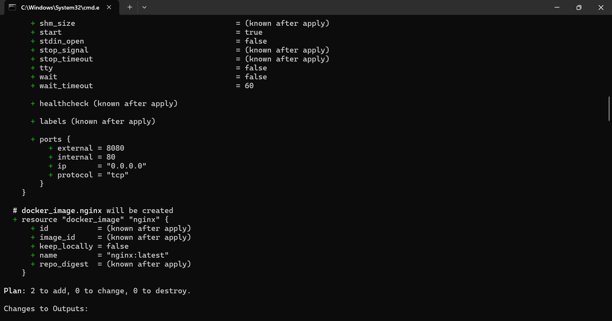
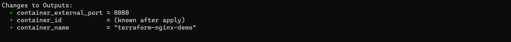

### 3. `terraform apply`

Applies the plan to create the resources.

#### Output
```shell
Terraform used the selected providers to generate the following execution plan. Resource actions are indicated with the following
symbols:
  + create

Terraform will perform the following actions:

  # docker_container.nginx_container will be created
  + resource "docker_container" "nginx_container" {
      + attach                                      = false
      + bridge                                      = (known after apply)
      + command                                     = (known after apply)
      + container_logs                              = (known after apply)
      + container_read_refresh_timeout_milliseconds = 15000
      + entrypoint                                  = (known after apply)
      + env                                         = (known after apply)
      + exit_code                                   = (known after apply)
      + hostname                                    = (known after apply)
      + id                                          = (known after apply)
      + image                                       = (known after apply)
      + init                                        = (known after apply)
      + ipc_mode                                    = (known after apply)
      + log_driver                                  = (known after apply)
      + logs                                        = false
      + must_run                                    = true
      + name                                        = "terraform-nginx-demo"
      + network_data                                = (known after apply)
      + read_only                                   = false
      + remove_volumes                              = true
      + restart                                     = "no"
      + rm                                          = false
      + runtime                                     = (known after apply)
      + security_opts                               = (known after apply)
      + shm_size                                    = (known after apply)
      + start                                       = true
      + stdin_open                                  = false
      + stop_signal                                 = (known after apply)
      + stop_timeout                                = (known after apply)
      + tty                                         = false
      + wait                                        = false
      + wait_timeout                                = 60

      + healthcheck (known after apply)

      + labels (known after apply)

      + ports {
          + external = 8080
          + internal = 80
          + ip       = "0.0.0.0"
          + protocol = "tcp"
        }
    }

  # docker_image.nginx will be created
  + resource "docker_image" "nginx" {
      + id           = (known after apply)
      + image_id     = (known after apply)
      + keep_locally = false
      + name         = "nginx:latest"
      + repo_digest  = (known after apply)
    }

Plan: 2 to add, 0 to change, 0 to destroy.

Changes to Outputs:
  + container_external_port = 8080
  + container_id            = (known after apply)
  + container_name          = "terraform-nginx-demo"

Do you want to perform these actions?
  Terraform will perform the actions described above.
  Only 'yes' will be accepted to approve.

  Enter a value: yes

docker_image.nginx: Creating...
docker_image.nginx: Still creating... [00m10s elapsed]
docker_image.nginx: Creation complete after 19s [id=sha256:029d4461bd98f124e531380505ceea2072418fdf28752aa73b7b273ba3048903nginx:latest]
docker_container.nginx_container: Creating...
docker_container.nginx_container: Creation complete after 3s [id=4a1379533c9d8ada30b8a8cb77c4ba4bf3be5aeabb77bcf2531ad52121371493]

Apply complete! Resources: 2 added, 0 changed, 0 destroyed.

Outputs:

container_external_port = 8080
container_id = "4a1379533c9d8ada30b8a8cb77c4ba4bf3be5aeabb77bcf2531ad52121371493"
container_name = "terraform-nginx-demo"
```


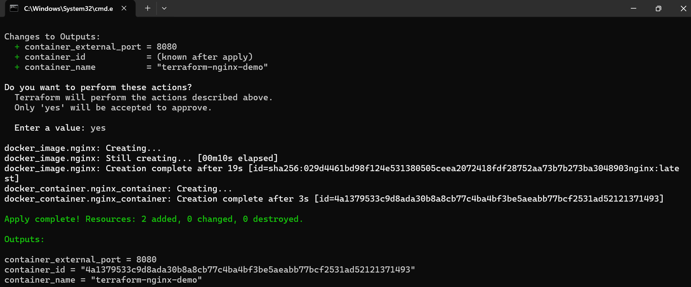

### 4. Verification (`docker ps`)

After applying, I verified the container was running using docker ps.

#### Output
```shell
CONTAINER ID   IMAGE          COMMAND                  CREATED              STATUS              PORTS                  NAMES
4a1379533c9d   029d4461bd98   "/docker-entrypoint.…"   About a minute ago   Up About a minute   0.0.0.0:8080->80/tcp   terraform-nginx-demo
```
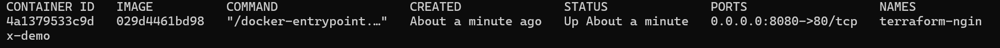

### 5. `terraform state list`

This command lists all resources tracked in the Terraform state file.

#### Output
```shell
docker_container.nginx_container
docker_image.nginx
```
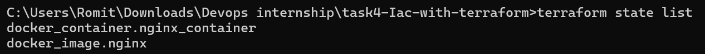

### 6. `terraform destroy`

Tears down all managed resources, destroying the container.

#### Output
```shell
docker_image.nginx: Refreshing state... [id=sha256:029d4461bd98f124e531380505ceea2072418fdf28752aa73b7b273ba3048903nginx:latest]
docker_container.nginx_container: Refreshing state... [id=4a1379533c9d8ada30b8a8cb77c4ba4bf3be5aeabb77bcf2531ad52121371493]

Terraform used the selected providers to generate the following execution plan. Resource actions are indicated with the following
symbols:
  - destroy

Terraform will perform the following actions:

  # docker_container.nginx_container will be destroyed
  - resource "docker_container" "nginx_container" {
      - attach                                      = false -> null
      - command                                     = [
          - "nginx",
          - "-g",
          - "daemon off;",
        ] -> null
      - container_read_refresh_timeout_milliseconds = 15000 -> null
      - cpu_shares                                  = 0 -> null
      - dns                                         = [] -> null
      - dns_opts                                    = [] -> null
      - dns_search                                  = [] -> null
      - entrypoint                                  = [
          - "/docker-entrypoint.sh",
        ] -> null
      - env                                         = [] -> null
      - group_add                                   = [] -> null
      - hostname                                    = "4a1379533c9d" -> null
      - id                                          = "4a1379533c9d8ada30b8a8cb77c4ba4bf3be5aeabb77bcf2531ad52121371493" -> null
      - image                                       = "sha256:029d4461bd98f124e531380505ceea2072418fdf28752aa73b7b273ba3048903" -> null
      - init                                        = false -> null
      - ipc_mode                                    = "private" -> null
      - log_driver                                  = "json-file" -> null
      - log_opts                                    = {} -> null
      - logs                                        = false -> null
      - max_retry_count                             = 0 -> null
      - memory                                      = 0 -> null
      - memory_swap                                 = 0 -> null
      - must_run                                    = true -> null
      - name                                        = "terraform-nginx-demo" -> null
      - network_data                                = [
          - {
              - gateway                   = "172.17.0.1"
              - global_ipv6_prefix_length = 0
              - ip_address                = "172.17.0.2"
              - ip_prefix_length          = 16
              - mac_address               = "f2:b0:8b:cd:d8:ca"
              - network_name              = "bridge"
                # (2 unchanged attributes hidden)
            },
        ] -> null
      - network_mode                                = "bridge" -> null
      - privileged                                  = false -> null
      - publish_all_ports                           = false -> null
      - read_only                                   = false -> null
      - remove_volumes                              = true -> null
      - restart                                     = "no" -> null
      - rm                                          = false -> null
      - runtime                                     = "runc" -> null
      - security_opts                               = [] -> null
      - shm_size                                    = 64 -> null
      - start                                       = true -> null
      - stdin_open                                  = false -> null
      - stop_signal                                 = "SIGQUIT" -> null
      - stop_timeout                                = 1 -> null
      - storage_opts                                = {} -> null
      - sysctls                                     = {} -> null
      - tmpfs                                       = {} -> null
      - tty                                         = false -> null
      - wait                                        = false -> null
      - wait_timeout                                = 60 -> null
        # (7 unchanged attributes hidden)

      - ports {
          - external = 8080 -> null
          - internal = 80 -> null
          - ip       = "0.0.0.0" -> null
          - protocol = "tcp" -> null
        }
    }

  # docker_image.nginx will be destroyed
  - resource "docker_image" "nginx" {
      - id           = "sha256:029d4461bd98f124e531380505ceea2072418fdf28752aa73b7b273ba3048903nginx:latest" -> null
      - image_id     = "sha256:029d4461bd98f124e531380505ceea2072418fdf28752aa73b7b273ba3048903" -> null
      - keep_locally = false -> null
      - name         = "nginx:latest" -> null
      - repo_digest  = "nginx@sha256:029d4461bd98f124e531380505ceea2072418fdf28752aa73b7b273ba3048903" -> null
    }

Plan: 0 to add, 0 to change, 2 to destroy.

Changes to Outputs:
  - container_external_port = 8080 -> null
  - container_id            = "4a1379533c9d8ada30b8a8cb77c4ba4bf3be5aeabb77bcf2531ad52121371493" -> null
  - container_name          = "terraform-nginx-demo" -> null

Do you really want to destroy all resources?
  Terraform will destroy all your managed infrastructure, as shown above.
  There is no undo. Only 'yes' will be accepted to confirm.

  Enter a value: yes

docker_container.nginx_container: Destroying... [id=4a1379533c9d8ada30b8a8cb77c4ba4bf3be5aeabb77bcf2531ad52121371493]
docker_container.nginx_container: Destruction complete after 1s
docker_image.nginx: Destroying... [id=sha256:029d4461bd98f124e531380505ceea2072418fdf28752aa73b7b273ba3048903nginx:latest]
docker_image.nginx: Destruction complete after 1s

Destroy complete! Resources: 2 destroyed.
```
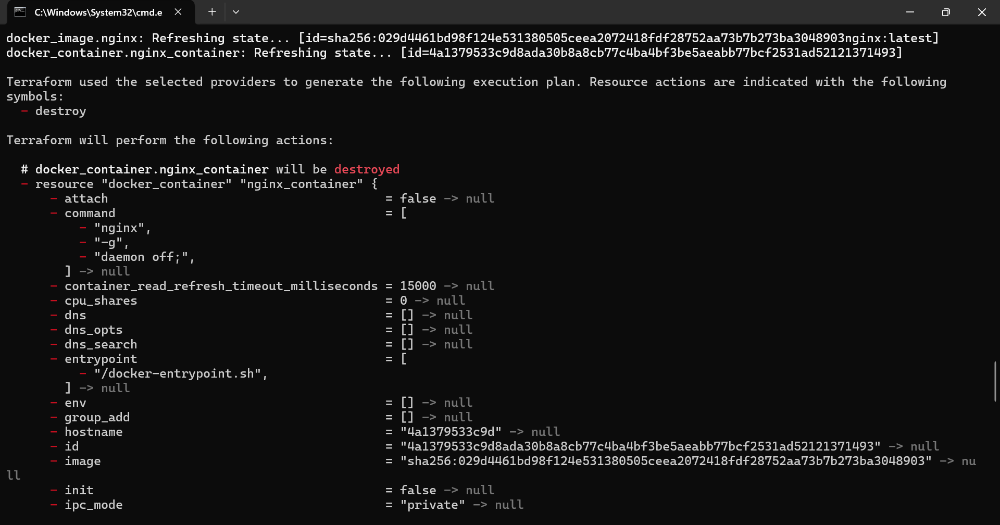
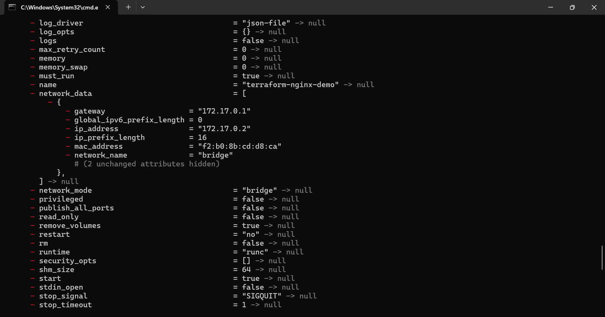
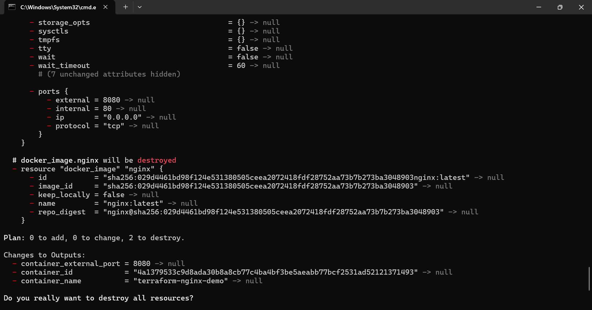
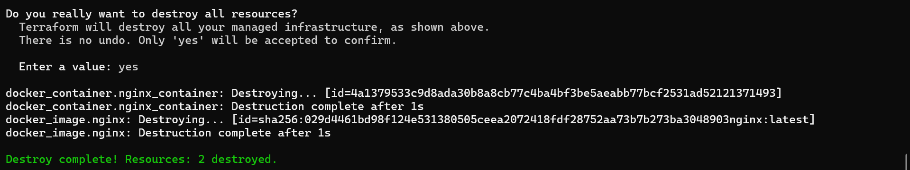
